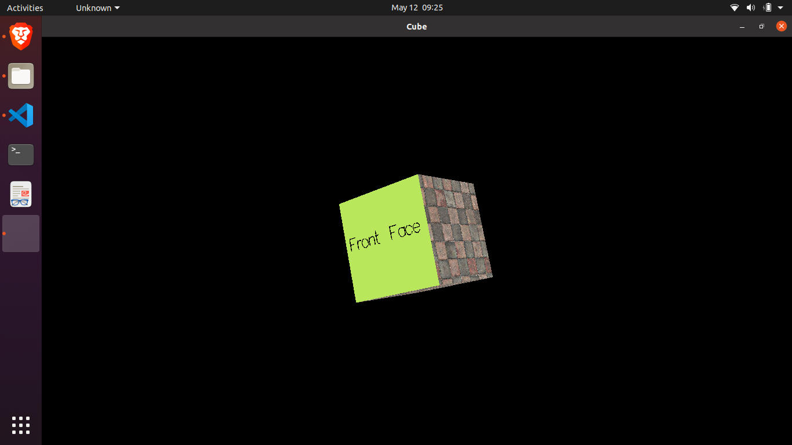

<html><head><meta content="text/html; charset=UTF-8" http-equiv="content-type"></head><body class="c9">
Working:

Code:
<table class="c7"><tbody><tr class="c11"><td class="c13" colspan="1" rowspan="1">
#include &lt;GL/glut.h&gt; /* including the glut library */  #include &lt;cmath&gt; /* for using sin, cos, sqrt */ #include &lt;cstdio&gt; /* for using printf and scanf */  #include &quot;imageio.h&quot;  #define WINDOW_WIDTH 1200 #define WINDOW_HEIGHT 700 #define ROT_AMT 10.0 #define LIGHT_INTENSITY_AMT 0.2  int&nbsp;texImageWidth; int&nbsp;texImageHeight; char&nbsp;texture_file[] = &quot;wall.png&quot;; char&nbsp;backface[] = &quot;Back Face&quot;; char&nbsp;frontface[] = &quot;Front Face&quot;; int&nbsp;initial_x, initial_y, flag;  static&nbsp;GLuint texture_handle[1]; &nbsp;//texture names  float&nbsp;light_intensity = 1.0f; GLfloat lightColor[] = {1.0f, 1.0f, 1.0f, 1.0f}; GLfloat lightPos[] = {100.0, 100.0, 100.0, 1.0}; /* Infinite light location. */  /* for defining a structure for representing a position vector */ struct&nbsp;Position&nbsp;{  &nbsp; float&nbsp;x, y, z; };  Position cameraPos = {0.0, 0.0, 1.0}; Position viewUpVector = {0.0, 1.0, 0.0};  /* this function calculates the square of the given number */ float&nbsp;sqr(float&nbsp;x)&nbsp;{  &nbsp; return&nbsp;((x) * (x)); }  /* for drawing given text at the given location */ void&nbsp;renderStrokeFontString(float&nbsp;x, float&nbsp;y, float&nbsp;z, char&nbsp;*string)&nbsp;{  &nbsp; char&nbsp;*c;  &nbsp; glPushMatrix();  &nbsp; glTranslatef((10&nbsp;* z) * x, y, z);  &nbsp; glScalef((10&nbsp;* z) * 0.00025, 0.00025, 1);   &nbsp; for&nbsp;(c = string; *c != &#39;\0&#39;; c++) {  &nbsp; &nbsp; &nbsp; glutStrokeCharacter(GLUT_STROKE_ROMAN, *c);  &nbsp; }  &nbsp; glPopMatrix(); }  /* load texture image */ GLubyte *makeTexImage(char&nbsp;*loadfile)&nbsp;{  &nbsp; int&nbsp;i, j, c, width, height;  &nbsp; GLubyte *texImage;  &nbsp; /* Only works for .png or .tif images. &nbsp;NULL is returned if errors occurred.  &nbsp; loadImageRGA() is from imageio library downloaded from Internet. */  &nbsp; texImage = loadImageRGBA((char&nbsp;*)loadfile, &amp;width, &amp;height);  &nbsp; texImageWidth = width;  &nbsp; texImageHeight = height;  &nbsp; return&nbsp;texImage; }  void&nbsp;drawCube()&nbsp;{  &nbsp; float&nbsp;x0 = -0.1, y0 = -0.1, x1 = 0.1, y1 = 0.1, z0 = 0.1;  &nbsp; float&nbsp;face[6][4][3] = {  &nbsp; &nbsp; &nbsp; {{x0, y0, z0}, {x1, y0, z0}, {x1, y1, z0}, {x0, y1, z0}}, &nbsp; &nbsp; /* front */  &nbsp; &nbsp; &nbsp; {{x0, y1, -z0}, {x1, y1, -z0}, {x1, y0, -z0}, {x0, y0, -z0}}, /* back */  &nbsp; &nbsp; &nbsp; {{x1, y0, z0}, {x1, y0, -z0}, {x1, y1, -z0}, {x1, y1, z0}}, &nbsp; /* right */  &nbsp; &nbsp; &nbsp; {{x0, y0, z0}, {x0, y1, z0}, {x0, y1, -z0}, {x0, y0, -z0}}, &nbsp; /* left */  &nbsp; &nbsp; &nbsp; {{x0, y1, z0}, {x1, y1, z0}, {x1, y1, -z0}, {x0, y1, -z0}}, &nbsp; /* top */  &nbsp; &nbsp; &nbsp; {{x0, y0, z0}, {x0, y0, -z0}, {x1, y0, -z0}, {x1, y0, z0}} &nbsp; &nbsp;/* bottom */  &nbsp; };  &nbsp; for&nbsp;(int&nbsp;i = 0; i &lt; 6; ++i) { &nbsp; &nbsp; &nbsp; &nbsp; &nbsp; &nbsp;/* draw cube with texture images */  &nbsp; &nbsp; &nbsp; if&nbsp;(i == 0) { &nbsp; &nbsp; &nbsp; &nbsp; &nbsp; &nbsp; &nbsp; &nbsp; &nbsp; &nbsp; &nbsp; &nbsp;/* for front face */  &nbsp; &nbsp; &nbsp; &nbsp; &nbsp; glBindTexture(GL_TEXTURE_2D, 0); /* do apply texture for this face */  &nbsp; &nbsp; &nbsp; &nbsp; &nbsp; glColor3f(0.0, 0.0, 0.0);  &nbsp; &nbsp; &nbsp; &nbsp; &nbsp; renderStrokeFontString(-0.09, 0.0, 0.1, frontface);  &nbsp; &nbsp; &nbsp; &nbsp; &nbsp; glColor3f(0.4, 0.5, 0.2);  &nbsp; &nbsp; &nbsp; &nbsp; &nbsp; glBegin(GL_QUADS);  &nbsp; &nbsp; &nbsp; &nbsp; &nbsp; glVertex3fv(face[i][0]);  &nbsp; &nbsp; &nbsp; &nbsp; &nbsp; glVertex3fv(face[i][1]);  &nbsp; &nbsp; &nbsp; &nbsp; &nbsp; glVertex3fv(face[i][2]);  &nbsp; &nbsp; &nbsp; &nbsp; &nbsp; glVertex3fv(face[i][3]);  &nbsp; &nbsp; &nbsp; &nbsp; &nbsp; glEnd();  &nbsp; &nbsp; &nbsp; } else&nbsp;if&nbsp;(i == 1) { &nbsp; &nbsp; &nbsp; &nbsp; &nbsp; &nbsp; &nbsp; &nbsp; /* for back face */  &nbsp; &nbsp; &nbsp; &nbsp; &nbsp; glBindTexture(GL_TEXTURE_2D, 0); /* do apply texture for this face */  &nbsp; &nbsp; &nbsp; &nbsp; &nbsp; glColor3f(0.4, 0.8, 0.1);  &nbsp; &nbsp; &nbsp; &nbsp; &nbsp; renderStrokeFontString(-0.09, 0.0, -0.1, backface);  &nbsp; &nbsp; &nbsp; &nbsp; &nbsp; glColor3f(1, 1, 1);  &nbsp; &nbsp; &nbsp; &nbsp; &nbsp; glBegin(GL_QUADS);  &nbsp; &nbsp; &nbsp; &nbsp; &nbsp; glVertex3fv(face[i][0]);  &nbsp; &nbsp; &nbsp; &nbsp; &nbsp; glVertex3fv(face[i][1]);  &nbsp; &nbsp; &nbsp; &nbsp; &nbsp; glVertex3fv(face[i][2]);  &nbsp; &nbsp; &nbsp; &nbsp; &nbsp; glVertex3fv(face[i][3]);  &nbsp; &nbsp; &nbsp; &nbsp; &nbsp; glEnd();  &nbsp; &nbsp; &nbsp; } else&nbsp;{  &nbsp; &nbsp; &nbsp; &nbsp; &nbsp; glBindTexture(GL_TEXTURE_2D, texture_handle[0]);  &nbsp; &nbsp; &nbsp; &nbsp; &nbsp; glBegin(GL_QUADS);  &nbsp; &nbsp; &nbsp; &nbsp; &nbsp; glTexCoord2f(0.0, 0.0);  &nbsp; &nbsp; &nbsp; &nbsp; &nbsp; glVertex3fv(face[i][0]);  &nbsp; &nbsp; &nbsp; &nbsp; &nbsp; glTexCoord2f(1.0, 0.0);  &nbsp; &nbsp; &nbsp; &nbsp; &nbsp; glVertex3fv(face[i][1]);  &nbsp; &nbsp; &nbsp; &nbsp; &nbsp; glTexCoord2f(1.0, 1.0);  &nbsp; &nbsp; &nbsp; &nbsp; &nbsp; glVertex3fv(face[i][2]);  &nbsp; &nbsp; &nbsp; &nbsp; &nbsp; glTexCoord2f(0.0, 1.0);  &nbsp; &nbsp; &nbsp; &nbsp; &nbsp; glVertex3fv(face[i][3]);  &nbsp; &nbsp; &nbsp; &nbsp; &nbsp; glEnd();  &nbsp; &nbsp; &nbsp; }  &nbsp; } }  /* Initialize OpenGL Graphics */ void&nbsp;initGL()&nbsp;{  &nbsp; glClearColor(0.0f, 0.0f, 0.0f, 1.0f); /* Set background color to black and opaque */  &nbsp; glClearDepth(1.0f); &nbsp; &nbsp; &nbsp; &nbsp; &nbsp; &nbsp; &nbsp; &nbsp; &nbsp; /* Set background depth to farthest */   &nbsp; glGenTextures(1, texture_handle);  &nbsp; GLubyte *texImage = makeTexImage(texture_file);  &nbsp; if&nbsp;(!texImage) {  &nbsp; &nbsp; &nbsp; fprintf(stderr, &quot;\nError reading %s \n&quot;, texture_file);  &nbsp; }  &nbsp; glBindTexture(GL_TEXTURE_2D, texture_handle[0]); /* now we work on handles */  &nbsp; glTexParameteri(GL_TEXTURE_2D, GL_TEXTURE_WRAP_S, GL_REPEAT);  &nbsp; glTexParameteri(GL_TEXTURE_2D, GL_TEXTURE_WRAP_T, GL_REPEAT);  &nbsp; glTexParameteri(GL_TEXTURE_2D, GL_TEXTURE_MAG_FILTER, GL_NEAREST);  &nbsp; glTexParameteri(GL_TEXTURE_2D, GL_TEXTURE_MIN_FILTER, GL_NEAREST);  &nbsp; glTexImage2D(GL_TEXTURE_2D, 0, GL_RGBA, texImageWidth,  &nbsp; &nbsp; &nbsp; &nbsp; &nbsp; &nbsp; &nbsp; &nbsp;texImageHeight, 0, GL_RGBA, GL_UNSIGNED_BYTE, texImage);   &nbsp; delete&nbsp;texImage; /* free memory holding texture image */   &nbsp; /* specifying the viewing frustum into the world coordinate system. */  &nbsp; glMatrixMode(GL_PROJECTION);  &nbsp; gluPerspective(/* field of view in degree */&nbsp;40.0,  &nbsp; &nbsp; &nbsp; &nbsp; &nbsp; &nbsp; &nbsp; &nbsp; &nbsp;/* aspect ratio */&nbsp;1.0,  &nbsp; &nbsp; &nbsp; &nbsp; &nbsp; &nbsp; &nbsp; &nbsp; &nbsp;/* Z near */&nbsp;1.0, /* Z far */&nbsp;10.0); }  /* Handler for window-repaint event. Called back when the window first appears and  &nbsp;whenever the window needs to be re-painted. */ void&nbsp;display()&nbsp;{  &nbsp; glClear(GL_COLOR_BUFFER_BIT | GL_DEPTH_BUFFER_BIT); &nbsp;// Clear color and depth buffers   &nbsp; /* Enabling required features of OpenGL */  &nbsp; glEnable(GL_LIGHTING);  &nbsp; glEnable(GL_LIGHT0);  &nbsp; glEnable(GL_TEXTURE_2D);  &nbsp; glEnable(GL_DEPTH_TEST);  &nbsp; glEnable(GL_CULL_FACE);  &nbsp; glEnable(GL_BLEND);  &nbsp; glEnable(GL_LINE_SMOOTH);  &nbsp; glEnable(GL_COLOR_MATERIAL);   &nbsp; glLineWidth(2.0); /* setting line width for glutStrokeCharacter */   &nbsp; glShadeModel(GL_FLAT); /* setting shading model to flat */   &nbsp; glBlendFunc(GL_SRC_ALPHA, GL_ONE_MINUS_SRC_ALPHA);   &nbsp; glTexEnvf(GL_TEXTURE_ENV, GL_TEXTURE_ENV_MODE, GL_DECAL);   &nbsp; glCullFace(GL_BACK); /* back-facing polygons are culled */   &nbsp; GLfloat ambientLight[] = {light_intensity, light_intensity, light_intensity, 1.0f};  &nbsp; glLightModelfv(GL_LIGHT_MODEL_AMBIENT, ambientLight);  &nbsp; glLightfv(GL_LIGHT0, GL_DIFFUSE, lightColor); &nbsp;/* Diffuse (non-shiny) light component */  &nbsp; glLightfv(GL_LIGHT0, GL_SPECULAR, lightColor); /* Specular (shiny) light component */   &nbsp; glColorMaterial(GL_FRONT, GL_AMBIENT_AND_DIFFUSE);   &nbsp; glMatrixMode(GL_MODELVIEW); /* To operate on model-view matrix */  &nbsp; glLoadIdentity(); &nbsp; &nbsp; &nbsp; &nbsp; &nbsp; /* Reset the model-view matrix */   &nbsp; /* set camera position (PRP) and viewing point (VRP) */  &nbsp; gluLookAt(cameraPos.x, cameraPos.y, cameraPos.z, 0, 0, 0, viewUpVector.x, viewUpVector.y, viewUpVector.z);   &nbsp; drawCube(); /* draw our cube */   &nbsp; glutSwapBuffers(); /* Swap the front and back frame buffers (double buffering) */  &nbsp; glDisable(GL_TEXTURE_2D); }  /* this function maps keyboard keys to actions */ GLvoid windowKey(unsigned&nbsp;char&nbsp;key, int&nbsp;x, int&nbsp;y)&nbsp;{  &nbsp; switch&nbsp;(key) {  &nbsp; &nbsp; &nbsp; case&nbsp;27: /* 27 is for esc key, press escape to exit */  &nbsp; &nbsp; &nbsp; &nbsp; &nbsp; exit(0);  &nbsp; &nbsp; &nbsp; case&nbsp;&#39;t&#39;: /* t is for reset */  &nbsp; &nbsp; &nbsp; &nbsp; &nbsp; light_intensity = 1.0;  &nbsp; &nbsp; &nbsp; &nbsp; &nbsp; cameraPos.x = 0.0;  &nbsp; &nbsp; &nbsp; &nbsp; &nbsp; cameraPos.y = 0.0;  &nbsp; &nbsp; &nbsp; &nbsp; &nbsp; cameraPos.z = 1.0;  &nbsp; &nbsp; &nbsp; &nbsp; &nbsp; viewUpVector.x = 0.0;  &nbsp; &nbsp; &nbsp; &nbsp; &nbsp; viewUpVector.y = 1.0;  &nbsp; &nbsp; &nbsp; &nbsp; &nbsp; viewUpVector.z = 0.0;  &nbsp; &nbsp; &nbsp; &nbsp; &nbsp; break;  &nbsp; &nbsp; &nbsp; case&nbsp;&#39;+&#39;: /* increase the light intensity */  &nbsp; &nbsp; &nbsp; &nbsp; &nbsp; if&nbsp;(light_intensity &lt; 1.0)  &nbsp; &nbsp; &nbsp; &nbsp; &nbsp; &nbsp; &nbsp; light_intensity += LIGHT_INTENSITY_AMT;  &nbsp; &nbsp; &nbsp; &nbsp; &nbsp; break;  &nbsp; &nbsp; &nbsp; case&nbsp;&#39;-&#39;: /* decrease the light intensity */  &nbsp; &nbsp; &nbsp; &nbsp; &nbsp; if&nbsp;(light_intensity &gt; 0.4)  &nbsp; &nbsp; &nbsp; &nbsp; &nbsp; &nbsp; &nbsp; light_intensity -= LIGHT_INTENSITY_AMT;  &nbsp; &nbsp; &nbsp; &nbsp; &nbsp; break;  &nbsp; &nbsp; &nbsp; default:  &nbsp; &nbsp; &nbsp; &nbsp; &nbsp; printf(&quot;Key %d has no action assigned.\n&quot;, key);  &nbsp; &nbsp; &nbsp; &nbsp; &nbsp; break;  &nbsp; };  &nbsp; glutPostRedisplay(); /* repaint the window after perfoming the updation */ }  /* this function is used to normalize the given point/vector */ Position normalize(Position point)&nbsp;{  &nbsp; Position normalized_point;  &nbsp; float&nbsp;x = point.x, y = point.y, z = point.z;  &nbsp; float&nbsp;norm = sqrt(sqr(x) + sqr(y) + sqr(z));  &nbsp; normalized_point.x = x / norm;  &nbsp; normalized_point.y = y / norm;  &nbsp; normalized_point.z = z / norm;  &nbsp; return&nbsp;normalized_point; }  /* this function returns the crossproduct of viewUpVector and CameraPosition and thus returns the viewRightVector */ Position crossProduct()&nbsp;{  &nbsp; float&nbsp;a, b, c, d, e, f;  &nbsp; a = viewUpVector.x;  &nbsp; b = viewUpVector.y;  &nbsp; c = viewUpVector.z;  &nbsp; d = cameraPos.x;  &nbsp; e = cameraPos.y;  &nbsp; f = cameraPos.z;  &nbsp; Position viewRightVector = {b * f - e * c, d * c - a * f, a * e - b * d};  &nbsp; return&nbsp;normalize(viewRightVector); }  /* this function rotates the given point about the given axis by the given angle */ Position rotateAboutAxis(Position point, float&nbsp;angle, Position axis)&nbsp;{  &nbsp; float&nbsp;c = cos(angle), s = sin(angle), x = axis.x, y = axis.y, z = axis.z;  &nbsp; float&nbsp;Mr[4][4] = {  &nbsp; &nbsp; &nbsp; {(1&nbsp;- c) * sqr(x) + c, (1&nbsp;- c) * x * y - s * z, (1&nbsp;- c) * x * z + s * y, 0},  &nbsp; &nbsp; &nbsp; {(1&nbsp;- c) * x * y + s * z, (1&nbsp;- c) * sqr(y) + c, (1&nbsp;- c) * y * z - s * x, 0},  &nbsp; &nbsp; &nbsp; {(1&nbsp;- c) * x * z - s * y, (1&nbsp;- c) * y * z + s * x, (1&nbsp;- c) * sqr(x) + c, 0},  &nbsp; &nbsp; &nbsp; {0, 0, 0, 1}};  &nbsp; Position new_point;  &nbsp; new_point.x = Mr[0][0] * point.x + Mr[0][1] * point.y + Mr[0][2] * point.z;  &nbsp; new_point.y = Mr[1][0] * point.x + Mr[1][1] * point.y + Mr[1][2] * point.z;  &nbsp; new_point.z = Mr[2][0] * point.x + Mr[2][1] * point.y + Mr[2][2] * point.z;  &nbsp; return&nbsp;normalize(new_point); }  GLvoid onMouseMotion(int&nbsp;x, int&nbsp;y)&nbsp;{  &nbsp; /* &nbsp;Calculate the amount of rotation given the mouse movement. */  &nbsp; float&nbsp;deltaAngleX = (2&nbsp;* M_PI / glutGet(GLUT_WINDOW_WIDTH)); /* a movement from left to right = 2*PI = 360 deg */  &nbsp; float&nbsp;deltaAngleY = (M_PI / glutGet(GLUT_WINDOW_HEIGHT)); &nbsp; &nbsp;/* a movement from top to bottom = PI = 180 deg */  &nbsp; float&nbsp;xAngle = (initial_x - x) * deltaAngleX;  &nbsp; float&nbsp;yAngle = (initial_y - y) * deltaAngleY;   &nbsp; Position viewRightVector = crossProduct();  &nbsp; /* &nbsp;Rotate the camera around the pivot point on the first axis */  &nbsp; Position new_point = rotateAboutAxis(cameraPos, yAngle, viewRightVector);   &nbsp; /* &nbsp;Rotate the camera around the pivot point on the second axis */  &nbsp; cameraPos = rotateAboutAxis(new_point, xAngle, viewUpVector);   &nbsp; viewUpVector = rotateAboutAxis(viewUpVector, yAngle, viewRightVector);   &nbsp; initial_x = x;  &nbsp; initial_y = y;  &nbsp; glutPostRedisplay(); }  /* function which gets activated whenever user presses a mouse button. It sets the initial x and y for use by onMouseMotion()*/ GLvoid mouseButtonPressed(GLint pressedButton, GLint cur_state, GLint x, GLint y)&nbsp;{  &nbsp; if&nbsp;(pressedButton != GLUT_LEFT_BUTTON)  &nbsp; &nbsp; &nbsp; return;   &nbsp; if&nbsp;(cur_state == GLUT_UP) {  &nbsp; &nbsp; &nbsp; flag = 0;  &nbsp; } else&nbsp;{  &nbsp; &nbsp; &nbsp; flag = 1;  &nbsp; &nbsp; &nbsp; initial_x = x;  &nbsp; &nbsp; &nbsp; initial_y = y;  &nbsp; } }  /* Handler for window re-size event. Called back when the window first appears and  &nbsp;whenever the window is re-sized with its new width and height */ void&nbsp;reshape(GLsizei width, GLsizei height)&nbsp;{ &nbsp;// GLsizei for non-negative integer  &nbsp; /* Compute aspect ratio of the new window */  &nbsp; if&nbsp;(height == 0) height = 1; /* To prevent divide by 0 */  &nbsp; GLfloat aspect = (GLfloat)width / (GLfloat)height;  &nbsp; glViewport(0, 0, width, height); /* Set the viewport to cover the new window */   &nbsp; /* Set the aspect ratio of the clipping volume to match the viewport */  &nbsp; glMatrixMode(GL_PROJECTION); /* To operate on the Projection matrix */  &nbsp; glLoadIdentity(); &nbsp; &nbsp; &nbsp; &nbsp; &nbsp; &nbsp;/* Reset */  &nbsp; /* Enable perspective projection with fovy, aspect, zNear and zFar */  &nbsp; gluPerspective(45.0f, aspect, 0.1f, 100.0f); }  /* Main function: GLUT runs as a console application starting at main() */ int&nbsp;main(int&nbsp;argc, char&nbsp;**argv)&nbsp;{  &nbsp; glutInit(&amp;argc, argv); &nbsp; &nbsp; &nbsp; &nbsp; &nbsp; &nbsp; &nbsp; &nbsp; &nbsp; &nbsp; &nbsp; &nbsp; &nbsp; &nbsp; &nbsp; &nbsp; &nbsp; &nbsp; &nbsp;// Initialize GLUT  &nbsp; glutInitDisplayMode(GLUT_RGBA | GLUT_DOUBLE | GLUT_DEPTH); &nbsp;// Enable double buffered mode  &nbsp; glutInitWindowSize(WINDOW_WIDTH, WINDOW_HEIGHT); &nbsp; &nbsp; &nbsp; &nbsp; &nbsp; &nbsp;// Set the window&#39;s initial width &amp; height  &nbsp; glutInitWindowPosition(0, 0); &nbsp; &nbsp; &nbsp; &nbsp; &nbsp; &nbsp; &nbsp; &nbsp; &nbsp; &nbsp; &nbsp; &nbsp; &nbsp; &nbsp; &nbsp; // Position the window&#39;s initial top-left corner  &nbsp; glutCreateWindow(&quot;Cube&quot;); &nbsp; &nbsp; &nbsp; &nbsp; &nbsp; &nbsp; &nbsp; &nbsp; &nbsp; &nbsp; &nbsp; &nbsp; &nbsp; &nbsp; &nbsp; &nbsp; &nbsp; // Create window with the given title  &nbsp; glutDisplayFunc(display); &nbsp; &nbsp; &nbsp; &nbsp; &nbsp; &nbsp; &nbsp; &nbsp; &nbsp; &nbsp; &nbsp; &nbsp; &nbsp; &nbsp; &nbsp; &nbsp; &nbsp; // Register callback handler for window re-paint event  &nbsp; glutReshapeFunc(reshape); &nbsp; &nbsp; &nbsp; &nbsp; &nbsp; &nbsp; &nbsp; &nbsp; &nbsp; &nbsp; &nbsp; &nbsp; &nbsp; &nbsp; &nbsp; &nbsp; &nbsp; // Register callback handler for window re-size event  &nbsp; initGL(); &nbsp; &nbsp; &nbsp; &nbsp; &nbsp; &nbsp; &nbsp; &nbsp; &nbsp; &nbsp; &nbsp; &nbsp; &nbsp; &nbsp; &nbsp; &nbsp; &nbsp; &nbsp; &nbsp; &nbsp; &nbsp; &nbsp; &nbsp; &nbsp; &nbsp; // Our own OpenGL initialization  &nbsp; glutKeyboardFunc(&amp;windowKey); &nbsp; &nbsp; &nbsp; &nbsp; &nbsp; &nbsp; &nbsp; &nbsp; &nbsp; &nbsp; &nbsp; &nbsp; &nbsp; &nbsp; &nbsp; // Our key pressed handler function  &nbsp; glutMouseFunc(&amp;mouseButtonPressed); &nbsp; &nbsp; &nbsp; &nbsp; &nbsp; &nbsp; &nbsp; &nbsp; &nbsp; &nbsp; &nbsp; &nbsp; // Registering mouse button handler function  &nbsp; glutMotionFunc(&amp;onMouseMotion); &nbsp; &nbsp; &nbsp; &nbsp; &nbsp; &nbsp; &nbsp; &nbsp; &nbsp; &nbsp; &nbsp; &nbsp; &nbsp; &nbsp; // Registering mouse motion handler function  &nbsp; glutMainLoop(); &nbsp; &nbsp; &nbsp; &nbsp; &nbsp; &nbsp; &nbsp; &nbsp; &nbsp; &nbsp; &nbsp; &nbsp; &nbsp; &nbsp; &nbsp; &nbsp; &nbsp; &nbsp; &nbsp; &nbsp; &nbsp; &nbsp; // Enter the infinite event-processing loop  &nbsp; return&nbsp;0; }
</td></tr></tbody></table>

Output:

</body></html>